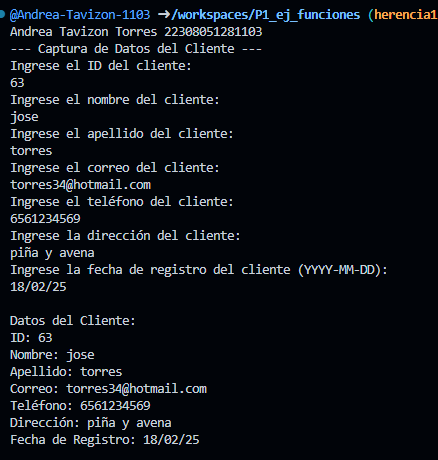
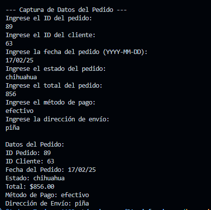

crear la clase Clientes con los atributos(id_cleinte, nombre, apellido, correo, telefono, direccion y fecha_registro) con una función capturadatos(), con interacción de interfaz de usuario. crear la clase DatosClientes con herencia  Clientes y una función mostrarDatos(). lenguaje dart

Salida de datos:

crear la clase Pedidos con los atributos(id_pedido, id_cliente, fecha_pedido, estado, total, metodo_pago y direccion_envio) con una función capturadatos(), con interacción de interfaz de usuario. crear la clase Datospedido con herencia  Pedidos y una función mostrarDatos(). lenguaje dart

Salida de datos: 

