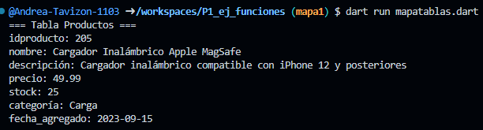
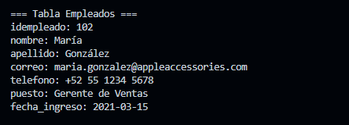
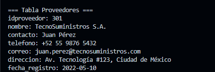

crear map <string, dinamic> productos con los siguentes key, idproducto, nombre, descripción, precio, stock, categoría, fecha_agregado, y mostrar los datos con un foreach, lenguaje dart

Salida de datos

crear map <string, dinamic> productos con los siguentes key, idproducto, nombre, descripción, precio, stock, categoría, fecha_agregado, y mostrar los datos con un foreach, lenguaje dart con datos de una empresa que vende accesorios para celular apple

Salida de datos

crear map <string, dinamic> empleados con los siguentes key, idempleado, nombre, apellido, correo, telefono, puesto, fecha_ingreso, y mostrar los datos con un foreach, lenguaje dart con datos de una empresa que vende accesorios para celular apple

Salida de datos
