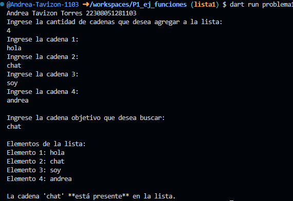

Crea un programa que tome una lista de cadenas (string) y una cadena objetivo, y determine si la cadena objetivo está presente en la lista que utilice 2 funciones una para capturar datos de la lista y otra para mostrar los elementos en lenguaje dart
